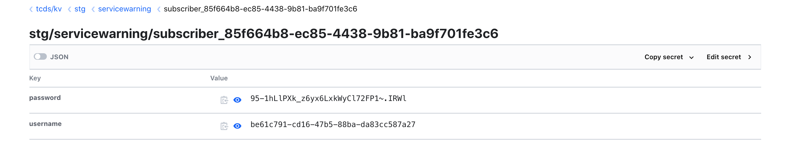

Service Warnings is a service designed to send car dashboard alerts to associated service subscribers for enrolled vehicles. It works by invoking a REST/webhook endpoint provided by the subscriber during the enrollment process.

## Configuration

Here is the sample configuration JSON, depicting the expected configurations that should be provided by the subscriber using [Vehicle Enrollment API](/api/vehicle-enrollment).

```json
{
  "authProtocol": "OAUTH_TYPE1",
  "authConfiguration": {
    "headerMap": {
      "Content-Type": "application/x-www-form-urlencoded"
    },
    "body": "grant_type=client_credentials",
    "endpoint": "https://auth-dev.tcmobility.net/oauth2/token",
    "authTokenTTL": 55
  },
  "clientConfiguration": {
    "headerMap": {
      "x-id-token": "REPLACE_SECRET",
      "Content-Type": "application/json"
    },
    "methodType": "PUT",
    "endpoint": "https://2te27hb5a2.execute-api.us-east-1.amazonaws.com/dev/events"
  }
}
```

Following table describes JSON configuration elements.

| Attribute      | Parent                | Description                                                                                                                                                                                                                                                                                  | Expected/sample value                                                               |
| -------------- | --------------------- | -------------------------------------------------------------------------------------------------------------------------------------------------------------------------------------------------------------------------------------------------------------------------------------------- | ----------------------------------------------------------------------------------- |
| `authProtocol` |                       | Authentication protocol used by the product subscriber like AWS cognito or Azure oAuth                                                                                                                                                                                                       | `OAUTH_TYPE1=AWS Cognito`, `OAUTH_TYPE2=Azure oAuth`                                |
| `headerMap`    | `authConfiguration`   | Expected headers for the oAuth call to be passed as map (header name and header value)                                                                                                                                                                                                       | `"headerMap": { "Content-Type": "application/x-www-form-urlencoded" }`              |
| `body`         | `authConfiguration`   | Expected body for the oAuth call to be passed as string                                                                                                                                                                                                                                      | `"body": "grant_type=client_credentials"`                                           |
| `endpoint`     | `authConfiguration`   | oAuth endpoint                                                                                                                                                                                                                                                                               | https://auth-dev.tcmobility.net/oauth2/token                                        |
| `authTokenTTL` | `authConfiguration`   | Configured auth token expiry time (internally used for caching the token)                                                                                                                                                                                                                    | `60`                                                                                |
| `headerMap`    | `clientConfiguration` | Expected headers to be passed for the subscriber REST/webhook endpoint as map (header name and header value). Header which is expected to have the oAuth Token, should have the REPLACE_SECRET placeholder, so that application logic replaces the placeholder with the generated authToken. | `{ "Authorization": " Bearer REPLACE_SECRET", "Content-Type": "application/json" }` |
| `endpoint`     | `clientConfiguration` | Client REST/webhook endpoint                                                                                                                                                                                                                                                                 | https://2te27hb5a2.execute-api.us-east-1.amazonaws.com/dev/events                   |
| `methodType`   | `clientConfiguration` | HTTP Method Type (PUT or POST)                                                                                                                                                                                                                                                               | `PUT`                                                                               |

<div class="notice">
As you observed the oAuth secrets were not passed as part of the config json, but are included directly from vault. 
</div>

## Onboarding oAuth Secrets

Service Warnings application logic relies on product subscription id to look up the oAuth credentials from the Vault. Here are the steps used to manually onboard the oAuth secrets to vault.

Create a vault secret for subscriber oAuth credentials as shown below. Vault secret key is the product subscription id and value is a JSON, which contains both username and password as single secret.



## Rotation of oAuth secrets

Sometimes, subscriber would like rotate the oAuth secrets according to their security constraints (may be every 6 months or so). In that case, we need to follow the below steps to ensure that the secrets stored in vault are updated.

1. Manually update the vault secret for that product subscriber
2. Restart the application server, so that the cached token is cleared and new tokens are created using the latest oAuth secrets.
